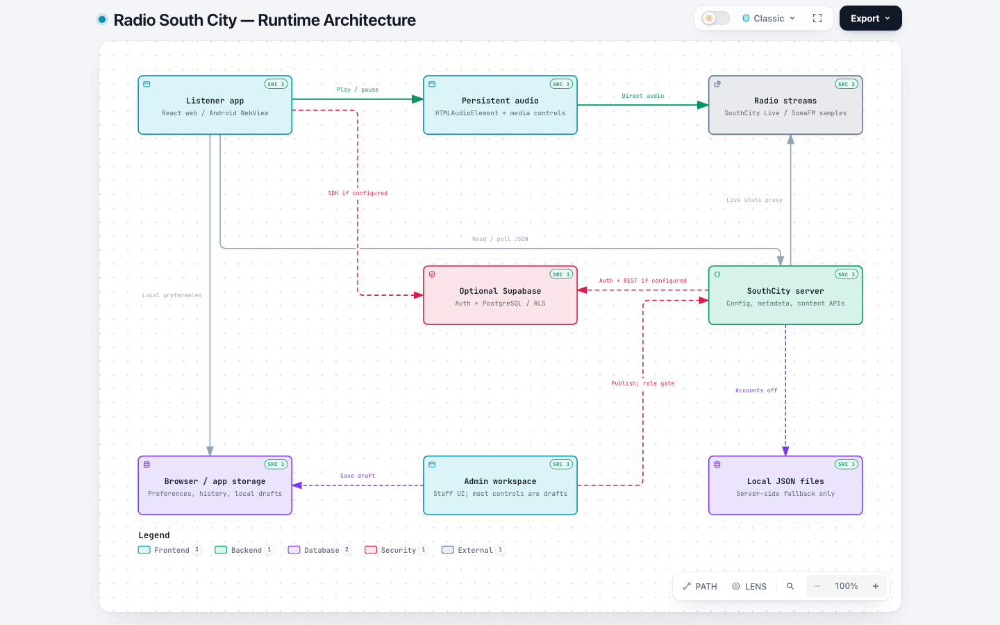

# Radio South City architecture

Analysis date: 2026-10-01. Source snapshot: [`ec66b0599996bb7d63a3bb2c125115092202e671`](https://github.com/rohitsharama2/SouthCity-Radio/tree/ec66b0599996bb7d63a3bb2c125115092202e671), inspected from a clean working tree. This describes implemented code, not independently verified production infrastructure.

[Interactive Archify map](../.archify/architecture-southcity-20261001-105225/southcity.html) · [Editable diagram specification](../.archify/architecture-southcity-20261001-105225/candidate.json) · [Validation receipt](../.archify/architecture-southcity-20261001-105225/review-2/southcity.finalize-summary.json)

GitHub displays HTML as source. Download the HTML and open it in a browser for the interactive viewer. The generated document is standalone; source links point to the pinned GitHub revision. No GitHub Pages deployment is implied.

## System shape

The product is one React/Vite codebase with listener and operations screens, a small Node HTTP server, an optional Supabase account/database service, and a Capacitor Android package. Audio takes a different path from metadata and published content: the client plays the stream directly, while the SouthCity server handles configuration, metadata proxying, and publishing.

| Unit                 | Responsibility                                                                                                  | Source                                                                                                                                                                         |
| -------------------- | --------------------------------------------------------------------------------------------------------------- | ------------------------------------------------------------------------------------------------------------------------------------------------------------------------------ |
| Listener application | Home, station discovery, profile/library state, persistent player UI; the navigation rails are currently hidden | [App.jsx](../src/App.jsx), [app.css](../src/styles/app.css)                                                                                                                    |
| Audio runtime        | One HTMLAudioElement, playback state, station switching, volume and sleep timer; mounted above navigation       | [AudioProvider.jsx](../src/components/AudioProvider.jsx), [mediaSession.js](../src/components/mediaSession.js)                                                                 |
| Operations workspace | Staff gate, station controls, local operational drafts, content editors                                         | [Admin.jsx](../src/components/Admin.jsx), [AdvertisementAdmin.jsx](../src/components/AdvertisementAdmin.jsx), [AnnouncementAdmin.jsx](../src/components/AnnouncementAdmin.jsx) |
| Application server   | Production static-file serving and the same API middleware used by Vite dev/preview                             | [production.js](../server/production.js), [vite.config.js](../vite.config.js)                                                                                                  |
| Live station adapter | Published station settings, limited metadata proxy, stream reachability check, short-lived caches               | [liveStation.js](../server/liveStation.js), [useLiveStream.js](../src/components/useLiveStream.js)                                                                             |
| Content publication  | Independent advertisement and announcement documents, input validation, authorization, Supabase/file adapters   | [publishedContent.js](../server/publishedContent.js), [advertisements.js](../server/advertisements.js), [announcements.js](../server/announcements.js)                         |
| Accounts             | Optional Supabase SDK, email/Google sign-in, profile/follow synchronization, server role checks                 | [useAccount.js](../src/components/useAccount.js), [accounts.js](../server/accounts.js)                                                                                         |
| Android shell        | Bundled web assets, native HTTP bridge, auth deep link, media notification integration                          | [capacitor.config.json](../capacitor.config.json), [AndroidManifest.xml](../android/app/src/main/AndroidManifest.xml), [server.js](../src/components/server.js)                |

## Main flows

### Listening and metadata

1. A user action selects a station and calls the audio provider. Changing pages does not recreate the provider or its audio element.
2. The audio element reads the station's public stream URL directly. The Node server does not relay the continuous audio stream.
3. SouthCity Live metadata is fetched separately through `/live-metadata/stats?sid=1&json=1` and `/live-metadata/played?sid=1&type=json`. The server only recognizes its configured metadata requests and derives their upstream host from the configured stream URL.
4. `useLiveStream` shares a poller among subscribers and pauses polling while the document is hidden. The server caches metadata for five seconds and station configuration for ten seconds.
5. Browser Media Session handlers or the Android native media-session plugin expose playback controls. This implementation is not proof of reliable behavior through every device interruption or power-management state.

Evidence: [AudioProvider.jsx](../src/components/AudioProvider.jsx), [useLiveStream.js](../src/components/useLiveStream.js), [liveStation.js](../server/liveStation.js), [mediaSession.js](../src/components/mediaSession.js).

### Accounts and library

The app requests public account configuration from `/api/auth-config`, then initializes the Supabase SDK only when that configuration is usable. Email links use PKCE; Google is offered if the account provider advertises it. On Android, sign-in returns through `com.southcity.radio://auth` and the app exchanges the code for a session.

The client talks directly to Supabase for its own profile and follows. SQL row-level security scopes those records to the authenticated user; column grants prevent clients from editing their own role. Preferences and listening history remain in local browser/app storage. Account synchronization is separate from the server's public-content publication flow.

Evidence: [useAccount.js](../src/components/useAccount.js), [accounts migration](../supabase/migrations/20260924000000_accounts.sql), [storage.js](../src/data/storage.js).

### Advertisements, announcements, and station settings

An admin editor has separate draft and publish actions. Saving a content draft writes only to the admin origin's browser storage. Publishing sends a PUT request with the signed-in user's access token when available.

With accounts configured, the server verifies the token and the persisted role before any publication. Only `station_manager` and `admin` may publish. It then writes to Supabase with that same caller token; database RLS and column grants are another enforcement layer. DJs can enter the workspace but cannot publish.

With accounts off, only loopback callers can publish. The server writes `.local/live-station.json`, `.local/advertisements.json`, or `.local/announcements.json`. These are server files, distinct from localStorage drafts. The fallback needs persistent server storage on a hosted deployment.

Home polls advertisements and announcements every 15 seconds while visible. Failed reads retain the component's last value, initially empty ad slots or a station welcome ticker. These are fallbacks, not confirmation that publication or a migration succeeded. Ads accept public HTTPS image/destination URLs, not file uploads. The ticker allows up to six single-line messages of at most 200 characters.

Evidence: [publishedContent.js](../server/publishedContent.js), [accounts.js](../server/accounts.js), [liveStation.js](../server/liveStation.js), [Advertisements.jsx](../src/components/Advertisements.jsx), [AnnouncementTicker.jsx](../src/components/AnnouncementTicker.jsx), [content validation](../src/data/announcements.js).

## API and persistence map

| Endpoint                                        | Reads                                  | Writes                                                       | Storage / upstream                                        |
| ----------------------------------------------- | -------------------------------------- | ------------------------------------------------------------ | --------------------------------------------------------- |
| `/api/auth-config`                              | GET public URL/key configuration       | None                                                         | Server environment; only public configuration is returned |
| `/api/live-station`                             | GET published live station settings    | PUT authorized configuration; optional reachability override | Supabase `live_station` or `.local/live-station.json`     |
| `/live-metadata/stats`, `/live-metadata/played` | GET allowlisted live telemetry queries | None                                                         | Configured stream host, short server cache                |
| `/api/advertisements`                           | GET four advertisement slots           | PUT all four slots                                           | Supabase `advertisements` or `.local/advertisements.json` |
| `/api/announcements`                            | GET enabled state and messages         | PUT ticker settings                                          | Supabase `announcements` or `.local/announcements.json`   |

Supabase `profiles` and `follows` are accessed through the authenticated SDK rather than bespoke SouthCity REST endpoints. Migration files also define publication audit fields and triggers. Migration availability in any deployed database must be checked separately; repository files alone cannot establish that state.

## Deployment and trust boundaries

- Development runs listener and admin Vite servers on 5180 and 5181. They are separate origins with separate browser storage. Both register the same server middleware and share local server files when accounts are off.
- Production `npm start` serves `dist` and the APIs from one Node server. A static-only host cannot implement publication, metadata proxying, or runtime account configuration.
- Android packages `dist` and calls the server set by `VITE_SOUTHCITY_SERVER`. The build rejects a missing/non-HTTPS server address. The native HTTP bridge handles those requests; audio still follows the station stream URL.
- The default live audio URL uses HTTP, and Android explicitly enables cleartext traffic. A secure website needs an HTTPS stream address; the Node API server does not solve mixed-content audio by itself.
- The public Supabase key is intentionally exposed through the configuration endpoint. No service-role key is required by this architecture. Server token verification and database permissions carry authorization; hidden navigation does not.
- Advertisement image requests go from the client to their configured hosts. No object-storage service, media upload pipeline, transcoding worker, campaign scheduler, or billing integration is implemented.

Evidence: [workspace ports](../src/data/workspaces.js), [Vite configuration](../vite.config.js), [production server](../server/production.js), [Android API routing](../src/components/server.js), [Android manifest](../android/app/src/main/AndroidManifest.xml), [station defaults](../src/data/liveStream.js).

## Maintenance observations

| Priority                    | Evidence-backed observation                                                                                                                                                                     | Suggested follow-up                                                                                                                       |
| --------------------------- | ----------------------------------------------------------------------------------------------------------------------------------------------------------------------------------------------- | ----------------------------------------------------------------------------------------------------------------------------------------- |
| High for release validation | `tests/helpers.js` navigates through the rails, but `.navigation-hidden` hides them in the current product. The legacy full browser suite is not a reliable passing release gate in this state. | Update user-flow tests for the intentionally reduced navigation; retain coverage of Home return, profile access, playback and publishing. |
| High for HTTPS web playback | The shipped live-stream default is HTTP. Android permits cleartext; HTTPS web pages do not automatically gain working audio.                                                                    | Configure and test TLS on the listener stream. Reassess Android cleartext permission once it is no longer needed.                         |
| Medium                      | Metadata/config requests have server caches, but `publishedContentMiddleware` reads Supabase for each content GET while each visible Home polls two documents every 15 seconds.                 | Measure expected audience load; consider a short shared cache with invalidation on successful publication.                                |
| Medium                      | Large `App.jsx` and `Admin.jsx` modules combine routing, orchestration and multiple screens.                                                                                                    | Extract screens by ownership as features grow, while preserving the audio provider's lifetime.                                            |
| Medium                      | Older handoff prose in `docs/FEATURES.md` says there is no native build and no publishing layer; Android and publication code now exist.                                                        | Reconcile those historical capability statements with current implementation.                                                             |

These are static maintenance observations, not a penetration test or a claim that deployed services are healthy. This task documents the code without changing application behavior.

## Refreshing the map

The analysis uses [tt-a1i/archify](https://github.com/tt-a1i/archify), installed as a Codex skill. Installation is workstation-local; the repository keeps the editable JSON and generated HTML rather than vendoring the tool into the app bundle.

For a fresh analysis, inspect the desired revision, create a new timestamped directory under `.archify/`, update the specification's repository revision, component citations and output path, then run the installed skill's `finalize architecture` command with `--repo-root` and `--quality showcase`. Do not simply change the revision without retracing changed code.

The historical `candidate.json` is pinned to the analyzed commit. Regenerating that unchanged snapshot is different from updating the analysis. See [.archify/README.md](../.archify/README.md) for commands and the latest validation evidence.
